# Django News
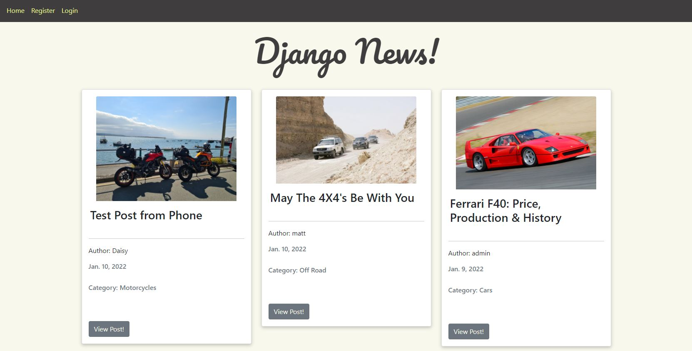

Django News is a News Blog Web App which can be used to Post articles of interest and to allows other users to read, comment and like each post.
Users are able to register an account with the app and create their own profile using their name, email and choosing a unique usernam. Once registered users can login to the app to allow them to use the like and comment functionality along with add post and choose categories of interest to view blog articles within the chosen category.
#

# Table Of Contents

1.  User Stories
2.  Design
3.  Features  
5.  Future Features
6.  Testing
7.  Validation
0.  Technologies Used
8.  Bugs 

#

# User Stories

The user requires certain functionality to enable the app to work as needed.

- Article Detailed View
- Create Posts
- Login and Logout
- Register
- Comments
- Like Posts
- Edit and Delete Posts

Whilst thinking about the users needs each requirement is added into the user stories within github.

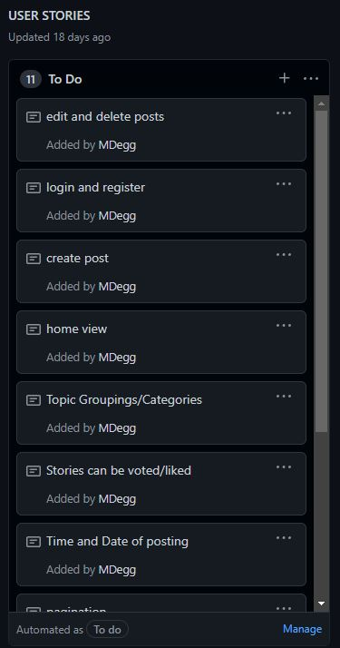

As the requirements are fulfilled within the app they are moved into the In Progress column.

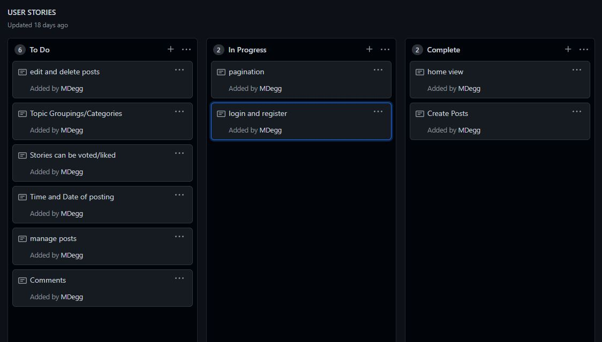

And finally added to the Complete column once the functionality has been completed.

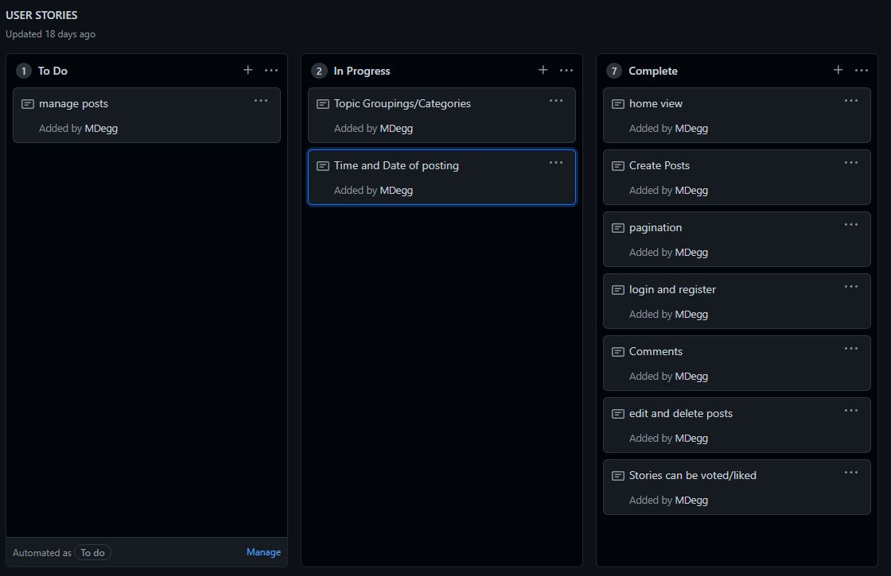

# Design 

## Colours 

The main body color for the project is rgb(248, 248, 236). I chose this colour as I wanted a plain, light colour scheme but found that white was too bland and decided an off white/yellow color worked well with the grey navbar and navigation links and buttons throughout the web app.

## Fonts

I kept the fonts to the Bootstrap standard "Helvetica Neue" as I found that this is an easy to read font. I used "Pacifico" for the logo to give it some style in orderf or it to stand out.

# Features

## Navbar

The website has a multi-functional navbar that allows the user to "Add Post", "Choose Category", "Edit Profile", Login and Logout respectively.

The Admin user also has an additional button "Add Category". This allows the Admin to add aditional Categories as they see fit.

If a User is not logged in the navbar shows different options "Home", "Register" and "Login".

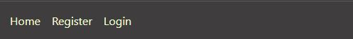

## Home Page

The homepage is where all of the posts are shown to the user. They are added to the page showing the most recent post first. The user is able to click the "View Post" button to view the detailed version of the post.

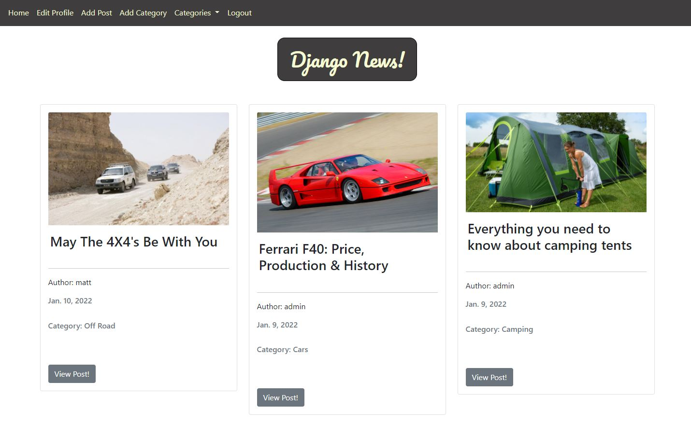

## Login and Register

The user is able to register, login and logout using the navbar navigation buttons. Each creating a new view or form to allow the user to login, logout or register.

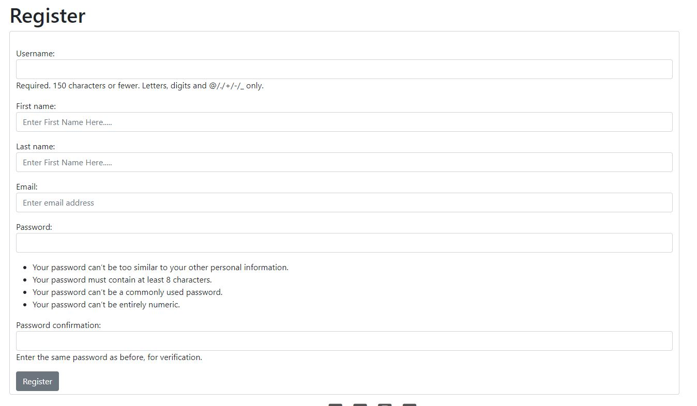

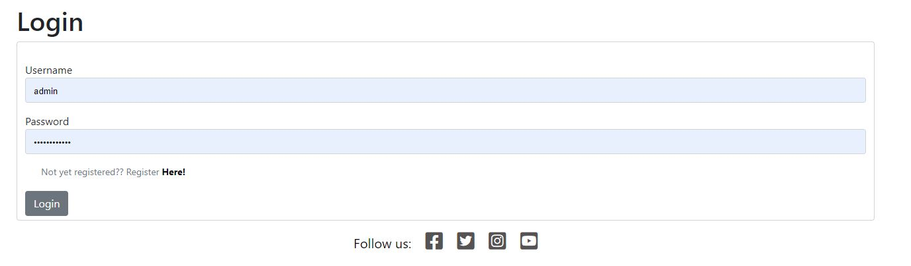

## Comment

Registered Users are able to comment on each post within the app but only when logged in.

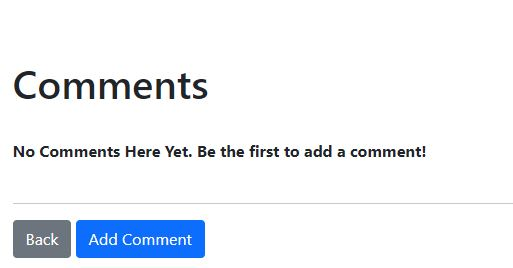
By clicking the Add Comment button the user is directed to the add comment form where they can create their comment and add to the existing post.

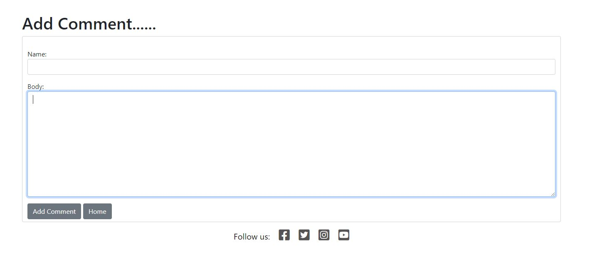

When a user is not logged in they are unable to comment.

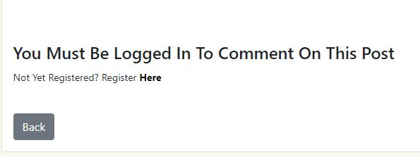

## Like

Registered Users are able to like each post within the app but only when logged in.

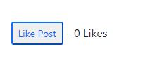

When liked the number of likes are added to the number of likes view.

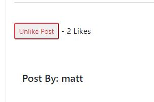

The like button also chnages colour to Red and allows the user to press again to Unlike.

## Post

Registered Users are able to create their own posts within the app but only when logged in. They can do this from the Add Post button within the navbar

The user is directed to the Add Post form where they can create their Blog Post. There are 5 sections to the form.

Title - a text field to allow user text input.
Title Tag - a text field to allow user text input.
Category - a dropdown menu to allow the user to choose which category they wish their post to sit within.
Body - Text Editor to allow text input
Image - Allows for user to upload images to their posts

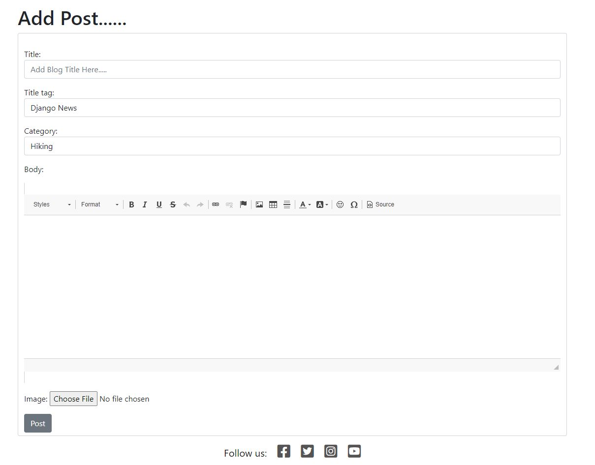

The form uses a Text Editor to provide the user with a better UX and also allows for different fonts, Bold Text, Italic Text etc.

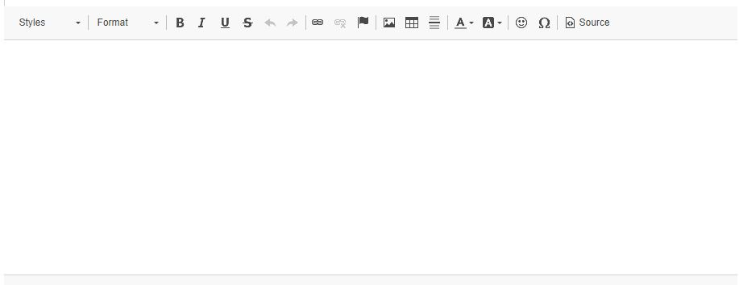

Once the Post has been created the user clicks the "Post" button to upload their post to the home page of the web app.

## Date

Each post is automatically stamped with the date of when the posts were uploaded.

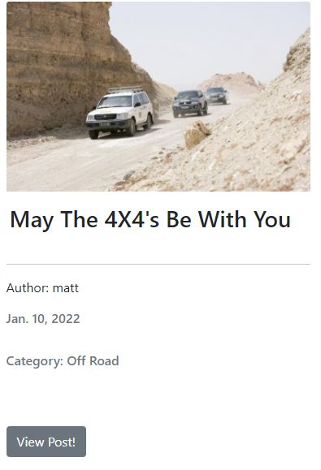

## Edit and Delete Post

Registered Users are able to edit or delete their own posts within the app but only when logged in.

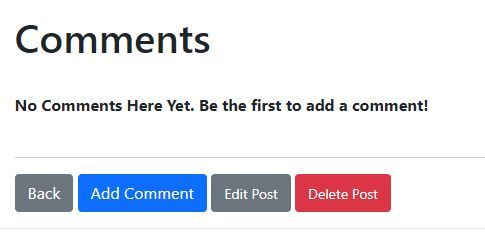

When a user is not registered or logged in they are not shown the "Edit Post" or "Delete Post" buttons.

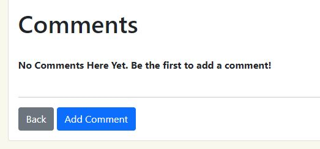

## Categories

Each post is given a category by choosing from the scroll down menu when creating a post. Each post is then added to the corresponding category list enabling the user to choose a category and view all posts within.

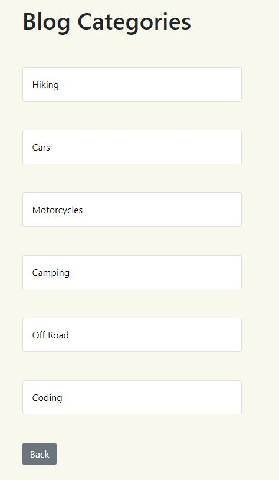

There is also a dropdown menu within the navbar to allow the user to choose a category to view from the homepage.

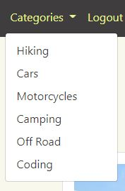

## Edit Profile

Users are able to change their username, email and password from the "Edit Profile" page. 

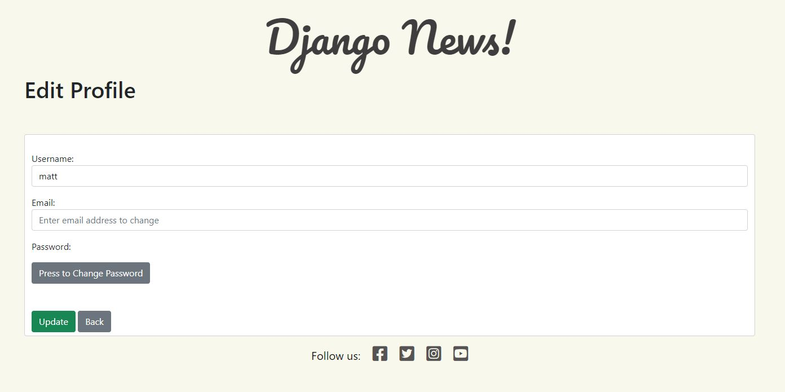

the "Change Password" button takes the user to a new form where they are able to change their password.

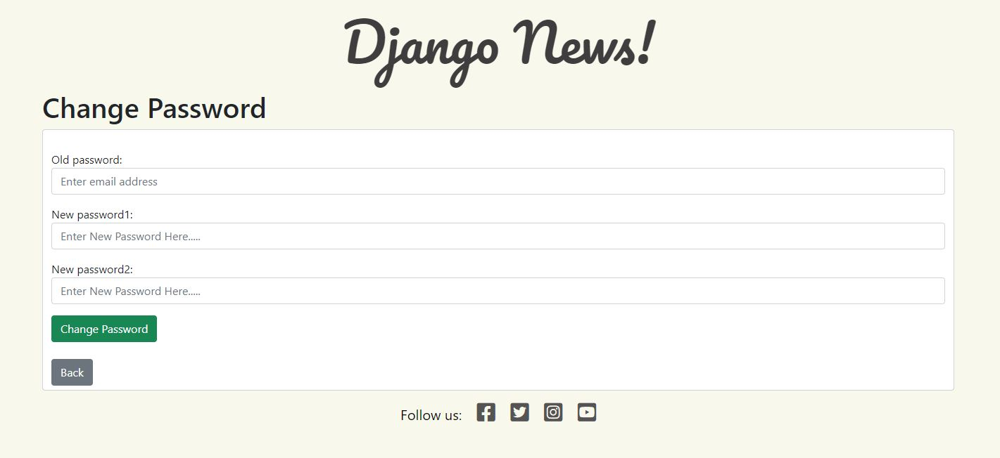

# 

## Future Features

- Profile page to include bio and profile picture.
- Comments to automatically populate the username instead of adding name to form.

#

## Testing

- Throughout the development of the application I would test each View, Model and URL together after each one had been written. 
- After migrating any models I would run the server whilst writing the code for the views and urls and watch the terminal show up any errors whilst writing the code. This would enable me to generally notice an issue in real time.
- Once the URL's were written and implemented as links within the app I would test each one to ensure that they worked correctly and directed me to the required page.
- The links were again tested in the final stages of development.
- Forms were also tested in the final stages to ensure that hey work as should. I registered multiple accounts and then deleted to ensure that this functionality works as it should. All error messages displayed and user information displayed as should also.
- Additional manual testing of the finished app included using dev tools to render the webpages within a mobile phone screen. Due to using bootstrap this functionality is automatic meaning less coding for different viewports.

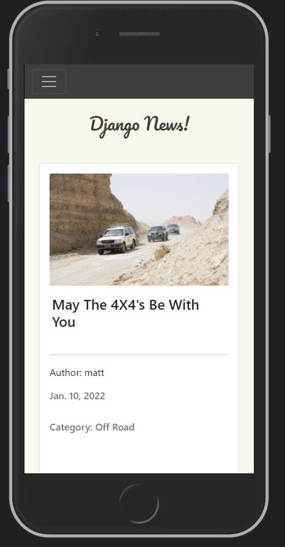

## Compatibility Testing

Once the website was complete it was tested on Google Chrome using dev tools and also a samsung mobile phone and tablet.
The website displayed as it should on all devices each of a different size.

## Performance Testing

I used the Lighthouse performance tool in dev tools to test the performance of the webpages...

- ### Home Page View

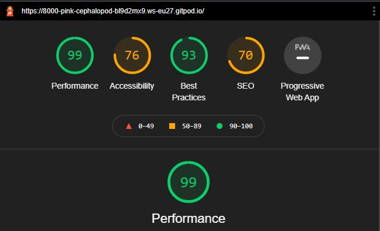

- ### Article Detail Page 

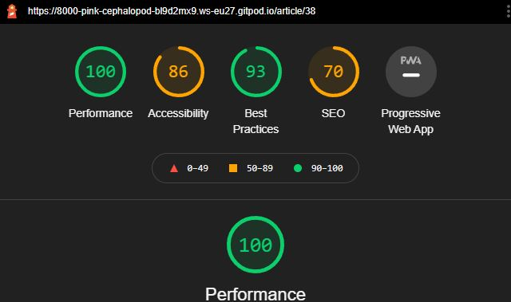

- ### Add Comment Page 

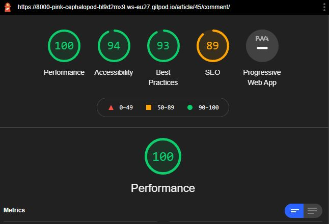

#

# Validation

## PEP8   

All of the python code has beenm PEP8 validated using Pythons built in auto validate function and then checked in the PEP8 validator online. Where some of the validation was showing as "line too long" I was unable to rectify without causing bugs within the code. Models and Views shown below...

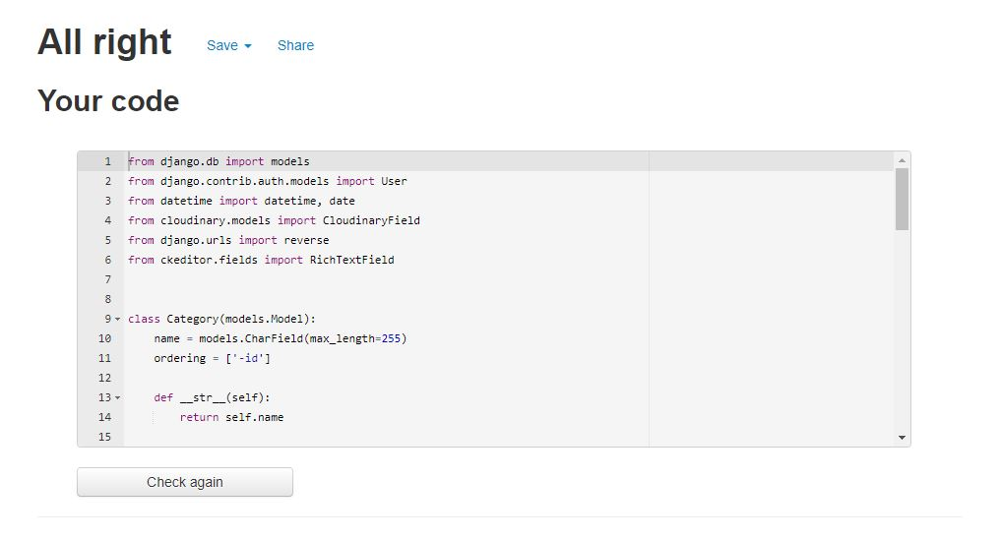
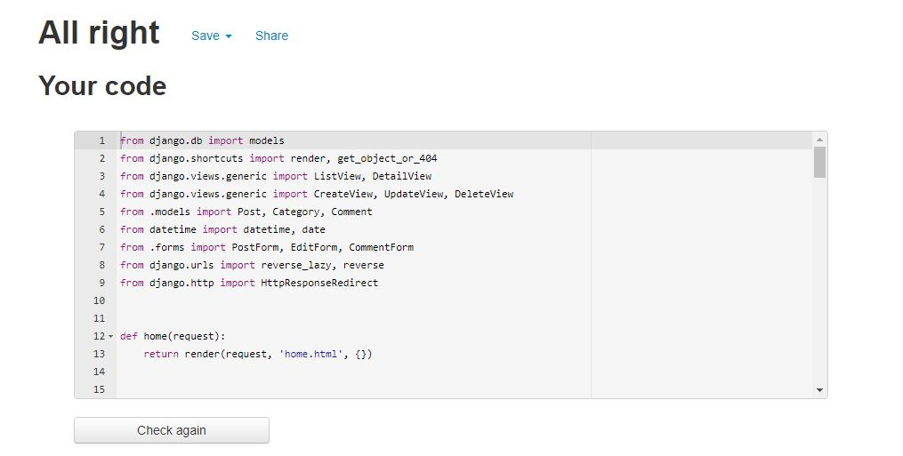

## CSS

W3C CSS Validator was used to validate the CSS file. No errors were found.

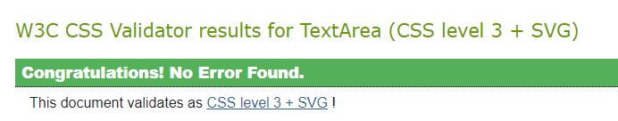

## HTML

W3C Markup Validation Service was used to validate all HTML files. There were some issues with the Python url's and syntax which meant that some code could only be checked and then tidied up manually.

## JavaScript

JavaScript was not checked for validation due to being only small snippets.

#

# Technologies Used

## Languages

- HTML, CSS, Python, Django and Javascript

## Database Framework

- Postgres

## Gitpod

- I used the GitPod Environment to create my workspace to allow me to add, commit and push to GitHub.

## Bootstrap

- I used Bootstrap to make responsive design much easier due to their "mobile first" design.

## Cloudinary

- Cloudinary was used to store all images uploaded to the website.

# Bugs

 Some bugs were noticed during the development stage. 

- CSRF Token - Trusted Origin Failure

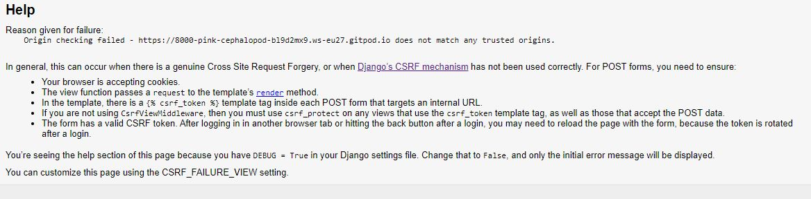

 Fix: I added the Web Page url to the CSRF_TRUSTED_ORIGINS within Settings.py to rectify this issue.

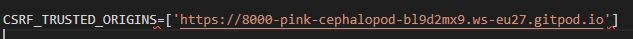

- Homepage View could not be found

Fix: Changed url by adding ' '/ to initial path.

#

# Deployment

The project was deployed to GitHub and pushed throughout the devlopment process. The project was also deployed to Heroku in the early stages of development to ensure that there weren't any issues later on in the project.
Auto deploy was selected within Heroku to ensure that each push from GitHub would push and deploy to Heroku.

## Method of Deployment

- In Heroku create new app 
- Added database to app using "Heroku Postgres"
- Set environment variables in env.py, "DATABASE_URL" and "SECRET_KEY"
- Copy DATABASE_URL to Settings.py
- Copy SECRET_KEY to Settings.py
- Migrate Changes

  #

# Credits

- [YouTube](https://www.youtube.com/) - Walkthrough videos and Django tutorials.
- [Code Institute](https://learn.codeinstitute.net/) - Django Cheatsheet
- [Font Awesome](https://fontawesome.com/) - Icons Used Within App
- [Google Fonts](https://fonts.google.com/) - Fonts Used Within App
- [Bootstrap](https://getbootstrap.com) 
- [Cloudinary](https://cloudinary.com)
- [Postgres](https://aiven.io/postgresql)
- [Heroku](https://www.heroku.com) 

# Content

- The text for the Article Details were taken from Wikipedia, The Great Outdoor Magazine, Everything Camping, MCN, Code Magazine,
- The icons in the footer were taken from 

# Media

- The photos used on the home and sign up page are from Google Images

# Acknowledgements

- Akshat Garg for mentor support
- Code Institute Tutor Support

